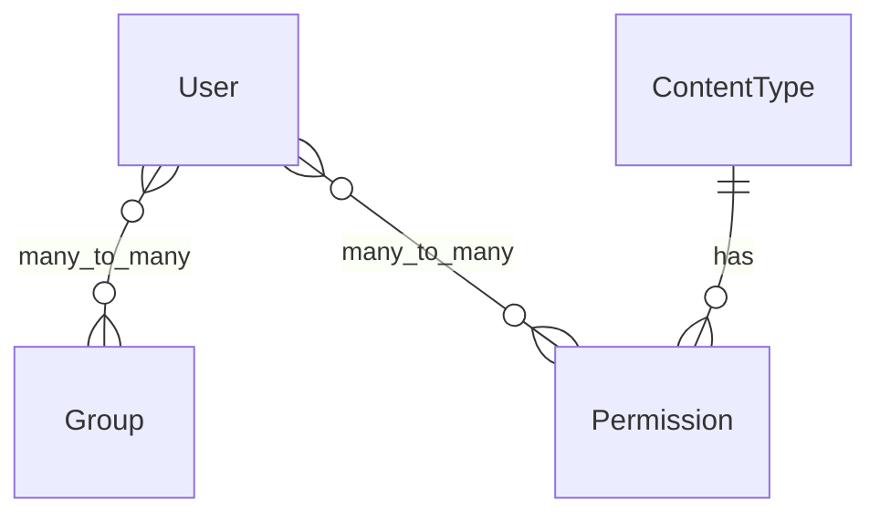
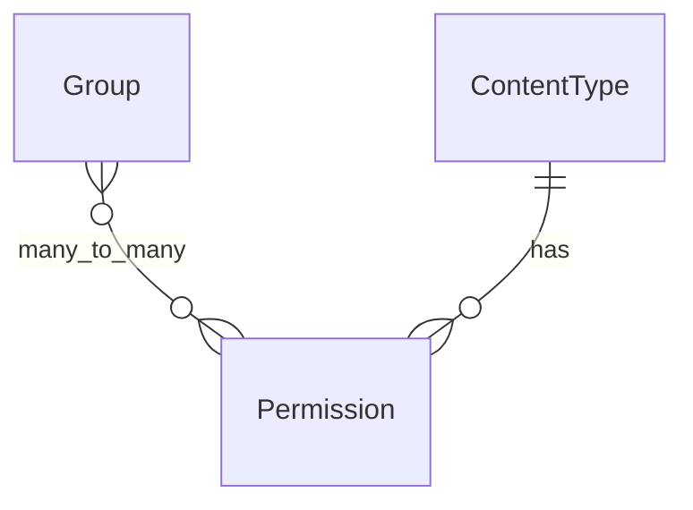
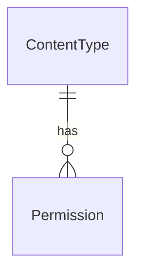

#  用户和权限

## 模型关系

### User

| 字段名                       | 类型                          | 描述                                                     |
| ---------------------------- | ----------------------------- | -------------------------------------------------------- |
| `username`                   | `CharField`                   | 必填。150字符以内，仅允许字母、数字及 @/./+/-/_ 符号。   |
| `password`                   | `CharField`                   | 密码（最大长度128）                                      |
| ` last_login`                | `DateTimeField`               | 上次登录时间，可以为空                                   |
| `first_name`                 | `CharField`                   | 名字（可选，最大长度150）。                              |
| `last_name`                  | `CharField`                   | 姓氏（可选，最大长度150）。                              |
| `email`                      | `EmailField`                  | 邮箱地址（可选）。                                       |
| `is_staff`                   | `BooleanField`                | 指定用户是否可以登录管理后台。                           |
| `is_active`                  | `BooleanField`                | 指定用户是否为活跃状态（禁用时取消勾选，而非删除账户）。 |
| `date_joined`                | `DateTimeField`               | 用户注册时间（自动生成，默认当前时间）。                 |
| `is_superuser`               | `BooleanField`                | 是否是超级用户，默认为False。指定该用户拥有所有权限。    |
| `groups(group_id)`           | `ManyToManyField(Group)`      | 该用户所属的组。用户将获得所有权限“授予他们每个小组。”   |
| `permissions(permission_id)` | `ManyToManyField(Permission)` | 此用户的特定权限。                                       |

### Group

| 字段名                       | 类型                          | 描述                                                   |
| ---------------------------- | ----------------------------- | ------------------------------------------------------ |
| `name`                       | `CharField`                   | 组名称（必填，150字符以内，唯一）。                    |
| `permissions(permission_id)` | `ManyToManyField(Permission)` | 权限集合（可留空，用户属于该组时将自动获得这些权限）。 |

### ContentType

| 字段名      | 类型        | 描述                                                    |
| ----------- | ----------- | ------------------------------------------------------- |
| `app_label` | `CharField` | 应用标签名称（最大长度100），对应 Django 应用的标识符。 |
| `model`     | `CharField` | 关联的模型类名称（最大长度100），表示具体模型类型。     |

### Permission

| 字段名                          | 类型                      | 描述                                                         |
| ------------------------------- | ------------------------- | ------------------------------------------------------------ |
| `name`                          | `CharField`               | 权限的显示名称（最大长度255），如 "can_edit_home_page"。     |
| `codename`                      | `CharField`               | 权限的机器可读名称（最大长度100），用于代码中引用权限，如 "add_user"。 |
| `content_type(content_type_id)` | `ForeignKey(ContentType)` | 关联的模型类型（外键到 `ContentType`，级联删除），表示权限所属的模型类别。 |

